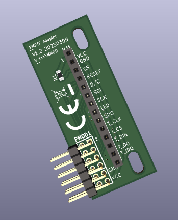

# meta-rz-pmod0-ili9341  
yocto meta layer for ili9341 + touch support  
Please see the corresponding sections below for details.  
  
Dependencies  
============  
  
The following meta packages are required:  
>poky  
>meta-renesas  
>meta-openembedded  
  
**Supported boards:**  
  
   *    Renesas RZFive-EVK [rzfive_vlp_v3.0.2]  
   *    Renesas RZG2L-EVK [rzg_bsp_v3.0.1]  
   *    Renesas RZG2UL-EVK [rzg_bsp_v3.0.1]  
   *    Renesas RZG2VL-EVK [rzv_bsp_v3.0.2]  
  
Patches  
=======  
  
To contribute to this layer you should email patches to renesas-rz@renesas.com.  
Please send .patch files as email attachments, not embedded in the email body.  
  
Table of Contents  
=================  
  
    I.   Adding the meta-rz-pmod0-ili9341 layer to your build  
    II.  Hardware connectivity  
    III. Misc  
  
I. Adding the meta-rz-pmod0-ili9341 layer to your build  
=======================================================  
  
Run 'bitbake-layers add-layer meta-rz-pmod0-ili9341'  
or add the following to the build/conf/bblayers.conf  
  
BBLAYERS += "${TOPDIR}/../meta-rz-pmod0-ili9341 "  
  
In addition please define the basic display rotation and   
the display size in the  
  
build/conf/local.conf file  
  
**\# supported rotation: 0, 90, 180, 270**  
**\# 0   - long connector line is at the bottom of the display pcb**  
**\# 90  - long connector line is at the left of the display pcb**  
**\# 180 - long connector line is at the top of the display pcb**  
**\# 270 - long connector line is at the right of the display pcb**  
**IS_PMOD0_ILI9341_ROT = "180"**  
  
**\# supported display size 2.4 or 2.8 inch**  
**IS_PMOD0_ILI9341_SIZE = "2.8"**  
  
For disabling the CONSOLE output during start the recommended way is to  
find out the available /dev/fb? devices and to map the output to a not existing device:  
  
**$** cat /proc/fb  
  
*0 fb_ili9341*  
  
The addition of the following variable to the u-boot "bootargs" will disable  
the console output(device 1 is the first unused device) in our example  
  
**fbcon=map:1**  
  
Remapping of the console with the "con2fbmap" tool will still be possible.  
  
 II. Hardware connectivity  
==========================  
  
| **PMOD0** |       |  **ILI9341 + touch PCB**|           |
|------------|-------|-------------------------|-----------|
|   1        |  CS   | 3                       | CS        |
|   2        |  MOSI | 6, 12                   | SDI, T_DIN|
|   3        |  MISO | 9, 13                   | SDO, T_DO |
|   4        |  SCK  | 7, 10                   | SCK, T_CLK|
|   5, 11    |  GND  | 2                       | GND       |
|   6, 12    |  VCC  | 1, 8                    | VCC, LED* |
|   7        |  INT  | 14                      | T_IRQ     |
|   8        |  RESET| 4                       | RESET     |
|   9        |  CS2  | 5                       | D/C       |
|   10       |  CS3  | 11                      | T_CS      |
  
VCC    - +3.3V  
Signal - +3.3V  
  
For a simplified connection of th TFT with the PMOD0 port of the EVK carrier board a  
design study is available within this meta package.  
[PCB-POC for a PMOD to TFT with touch adapter](pcb)  
  
  
  
  
**LED***
Some TFT modules have direct LED backlight connection to the LED pin other have a  
transistor. As the PMOD0 interface has no functional pin left the PWM is not  
implemented.  
  
**Note:**  
***EVK PMOD0 VCC should be set to 3.3V.***  
Please bridge the 5V to 3.3V regulator on the TFT-PCB.  
Most boards have a solder point or a jumper for it.  
  
**Note:**  
PMOD0 is of type PMOD 2A(extended SPI) (near to the PCB carrier board corner)  
  
III. Misc  
=========  
  
**DISPLAY:**  
> ILI9341 display with a XPT2046(or compatible touch controller)  
> (1x14pin connector, preferred PCB with FET on LED line + regulator)  
[LCD WIKI](http://www.lcdwiki.com/Main_Page#SPI_Display) modules with  
  
**Resolution:** 240 x 320  
  
**Size: **      2.4 or 2.8 inch  
  
**touch device  :** /dev/input/ts_uinput  
  
**display device:** /dev/fb0  
  
The basic settings are for the above configuration.  
  
There are different touch panels on the market the predefined  
calibration values may fail.  
The following steps explains the re-calibration:  
  
$ systemctl stop ts_uinput.service  
  
$ ts_calibrate  
  
$ systemctl start ts_uinput.service  
  
update the **pointercal_**<**size**>.<**orientation**> files inside of the  
**meta-rz-pmod0-ili9341/recipes-common/recipes-graphics/tslib/tslib**  
directory based on the data in the **/etc/pointercal** directory.  
Please update the calibration data for all four orientations. A rotation change  
will require an rebuild with adapted IS_PMOD0_ILI9341_ROT entries.  
  
**frame buffer device mapping:**

| EVK    | meta-rz-pmod0-ili9341| primary display| ili9341 display  |
|--------|----------------------|----------------|------------------|
| RZG2L  | used                 | /dev/fb1       | /dev/fb0         |
| RZV2L  | used                 | /dev/fb1       | /dev/fb0         |
| RZG2UL | used                 | N/A            | /dev/fb0         |
| RZFIVE | used                 | N/A            | /dev/fb0         |  
  
.
