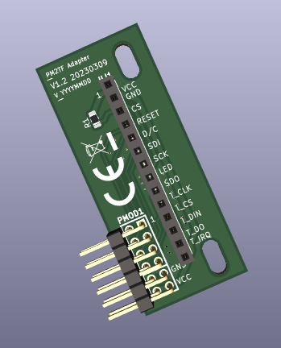
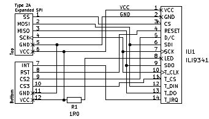

# PM2TF adapter board case study 

The PM2TF adapter board allows an easy connection  
of a TFT with touch support as it is available on the market.  
The focus of the board are 2.4 and 2.8 inch PCB boards with a  
14pin connector (pin function and position must match).  
  
The PMOD1 connector on PM2TF pcb (left side of following picture)  
complies with the "Digilent Pmod&trade; Interface Specification"  
and can be plugged into the Renesas RZ[VG] PMOD1 carrier board  
connector directly.  

The TFT connector on the right side is compatible to the   
MSP2807 and MSP2402 ILI9341 based modules with touch display.  
[LCD WIKI](http://www.lcdwiki.com/Main_Page#SPI_Display) modules with  
the same interface made by other vendors could be compatible  
(signal voltage level is 0V-3.3V) too.  

  
*3D drawing of the PM2TF adapter board*  

The following picture shows the connectivity between the two connectors.  
Some of the TFT modules have a MOSFET in the LED power-line. In that case the  
R1 resistor value has no impact on the display brightness.  
The board does not support PWM for LED brightness control (no spare pin available)  

  
*PM2TF board schematic*  
  
# PM2TF production trial data  
  
In the [trial prodcution data](production_data) directory are a set of files  
which can be used as example for an own PCB.  
(The trial study data was made with design rules of JLCPCB  
please feel free to adapt them following your needs).  
  
|  File                |  Function     |
|----------------------|---------------|
| GERBER-PM2TF_LOGO.zip|  Gerber data  |
| CPL-PM2TF_LOGO.csv   |  for assembly |
| BOM-PM2TF_LOGO.csv   |  for assembly |
|                      |               |
  
**Cautionary points**  
For convenience the PCB Gerber data has the CE and the EU RoHS Logo  
already on the top side. The user of the board is responsible to keep the regularities  
for the usage of the Logos.  
  
Other important points to consider:
[Digilent Pmod&trade license agreement](https://digilent.com/reference/pmod/license-agreement?redirect=1)
  
There was no trial production with assembly by JLCPCB for the PM2TF board yet.  

